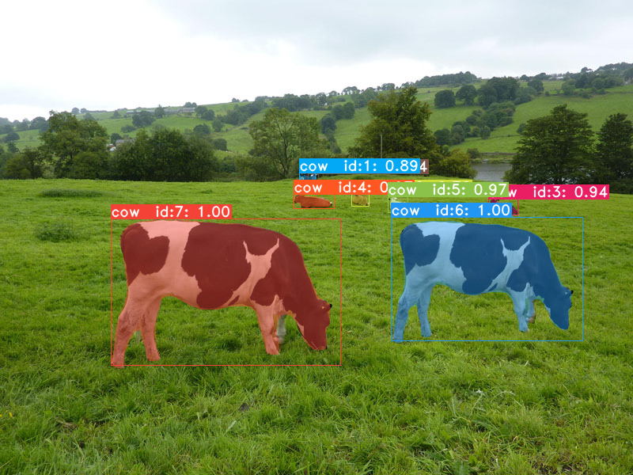
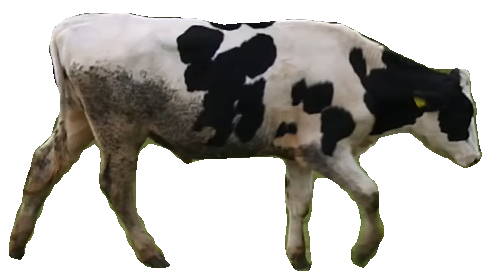

목장 CCTV 영상에서 소를 식별하기 위한 이미지 데이터 만들기 
==============================================

목적: yolact 기반으로 추적기 달고 배경 지워서
소 식별 데이터를 빠르게 만들기

왜 : 그런걸 만드느냐?

소 무늬를 통해 ai로 식별 가능하다는 논문은 많은데 
정작 산업에 적용하려고 보니 데이터가 없는 문제가 있습니다. 
논문에서는 Yolo를 통해 이미지를 한마리 한마리 모았는데
어느 세월에 그렇게 다 모으고 있나 싶어
추적기 달고 전처리를 위해 배경도 지우게 만들었습니다. 

왜2 : 소 식별해서 무엇하나?

목장가서 1시간만 일하면 알게됩니다. 

+ 추적기 달기

+ 배경 지우기

